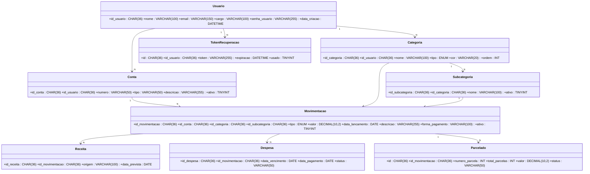

# Diagrama de Classes

## Sistema de Gerenciamento de Receitas

## 1. Objetivo

Este documento apresenta as principais entidades do sistema e seus relacionamentos, considerando a estrutura atual do banco `banco_tcc`.

## 2. Diagrama

## 3. Classes principais

| Classe | Responsabilidade |
|---|---|
| `Usuario` | Armazena os dados e informações de acesso do usuário. |
| `Categoria` | Organiza as movimentações por categoria e tipo. |
| `Subcategoria` | Detalha uma categoria. |
| `Conta` | Representa a conta vinculada às movimentações. |
| `Movimentacao` | Registra os lançamentos financeiros. |
| `Receita` | Armazena informações complementares de receitas. |
| `Despesa` | Armazena informações complementares de despesas. |
| `Parcelado` | Controla informações de parcelamento. |
| `TokenRecuperacao` | Controla tokens de recuperação de acesso. |

## 4. Relacionamentos

- Um `Usuario` pode possuir várias `Categoria`.
- Um `Usuario` pode possuir várias `Conta`.
- Um `Usuario` pode possuir vários `TokenRecuperacao`.
- Uma `Categoria` pode possuir várias `Subcategoria`.
- Uma `Conta` pode estar relacionada a várias `Movimentacao`.
- Uma `Categoria` pode estar relacionada a várias `Movimentacao`.
- Uma `Subcategoria` pode estar relacionada a várias `Movimentacao`.
- Uma `Movimentacao` pode possuir registros em `Receita`.
- Uma `Movimentacao` pode possuir registros em `Despesa`.
- Uma `Movimentacao` pode possuir registros em `Parcelado`.

## 5. Observação

Os identificadores do banco atual utilizam `CHAR(36)` com geração padrão por `UUID()`. Portanto, o diagrama foi atualizado para não utilizar `INT` como tipo das chaves identificadoras.
